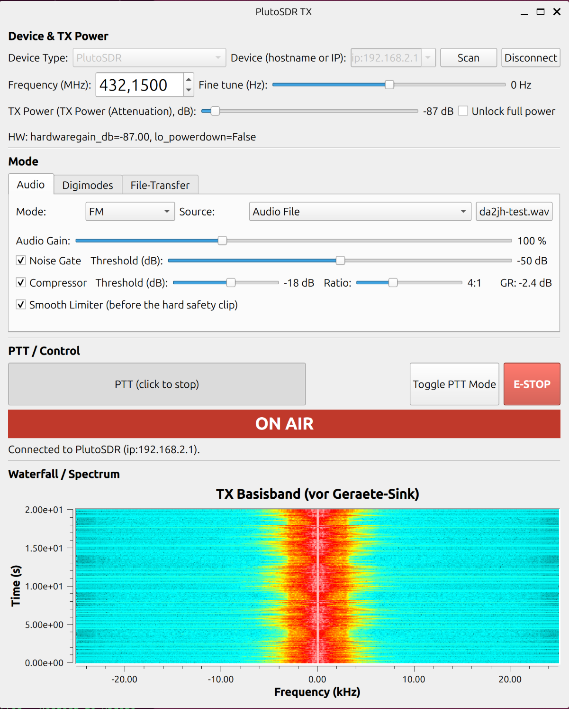
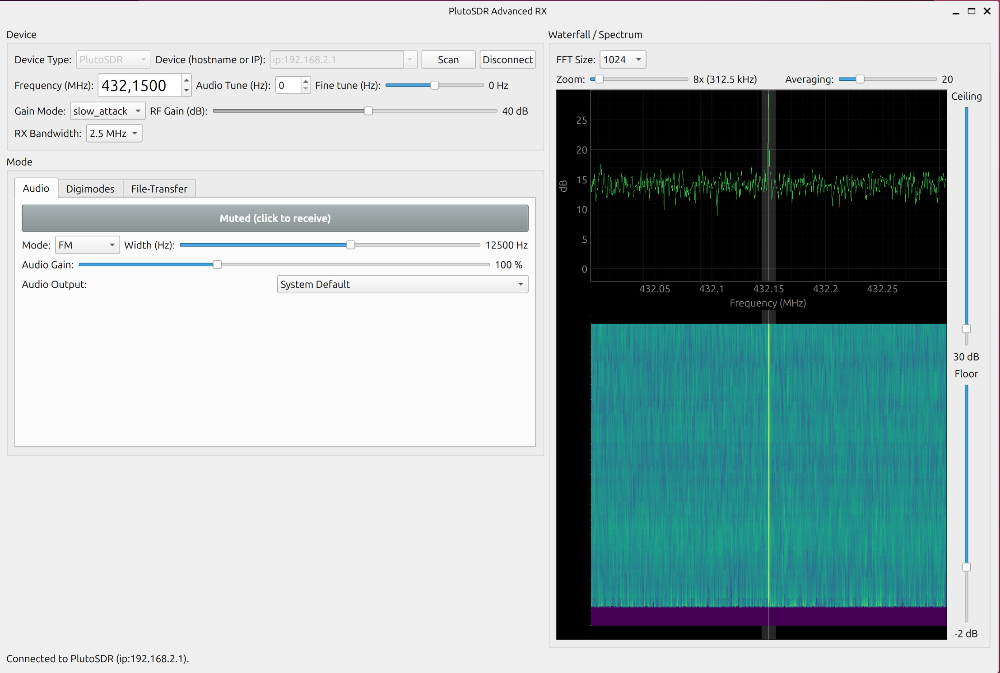

# pluto-tx

Eigene Sende- und Empfangssoftware für den ADALM-PLUTO (Pluto+,
Tezuka-Firmware), HackRF One und RTL-SDR, gebaut mit GNU Radio —
FM/SSB-Sprechfunk, mehrere Digitalsprache-Modi (M17, FreeDV 2020/2020B,
RADE), Digimodes (Waterfall Writer, PSK31, RTTY, POCSAG, FT8, Meshtastic/LoRa, MeshCore/LoRa) und ein wiederholender
Datei-Broadcast. Entstanden, weil vorhandene TX-Software (SDRangel) den
AD9361-Sendezweig nach "Stop" aktiv weitersenden ließ — dieses Projekt
legt deshalb besonderen Wert auf eine eigene, von GNU Radio unabhängige
Sicherheitsschicht (siehe [Sicherheit](#sicherheit)).

Vier Programme, ein Repo:

- **`pluto-tx`** — Sende-App (GUI)
- **`pluto-advanced-rx`** — Empfänger-App mit interaktivem, SDR++-artigem
  Wasserfall (GUI)
- **`pluto-cli`** — headless Kommandozeilen-Zugriff auf die wichtigsten
  Funktionen beider Apps, für Skripte/Automatisierung ([volle
  Referenz](pluto_cli/README.md))
- **`web-trx`** — Browser-Oberfläche für Senden und Empfangen übers Netz
  oder VPN, mit Wasserfall, Audio und Digimodes ([Anleitung](web-trx/README.md)).
  Start und Stopp auch aus beiden Apps heraus.

**Sendebetrieb nur mit gültiger Amateurfunklizenz.** Verantwortung für
Frequenzwahl, Bandplan und Sendeleistung liegt beim Betreiber.

## Auf einen Blick

| | |
|---|---|
| **TX-Modi** (`pluto-tx`) | FM (optional mit CTCSS/DCS), SSB (USB/LSB), M17, FreeDV 2020/2020B, RADE V1, File Broadcast, Baseband |
| **RX-Modi** (`pluto-advanced-rx`) | FM, SSB (USB/LSB), RADE V1, M17, Baseband |
| **Digimodes** (beide Apps, eigener Reiter) | Waterfall Writer (Text im Wasserfall), PSK31-Chat, RTTY, POCSAG (Funkruf), FT8, Meshtastic (LoRa; nur Pluto/HackRF/RTL-SDR), MeshCore (LoRa, nur RF-Geräte) |
| **Hardware** | PlutoSDR/Pluto+ (TX+RX), HackRF One (TX+RX), RTL-SDR (RX), Soundkarte/externes Funkgerät (TX+RX), AIOC-Adapter/analoges Funkgerät (TX) |
| **Automatisierung** | `pluto-cli` — dieselbe Codebasis headless, `--json`-Ausgabe |
| **Fernbetrieb** | `web-trx` — Browser-Oberfläche (FastAPI + Svelte) auf derselben Codebasis, ein Betreiber, Login, HTTPS |
| **Sicherheit** | NOTAUS, von GNU Radio unabhängige Abschalt-Logik, Live-Hardware-Readout |

<p align="center">
  
  
</p>

## Installation

```
./install.sh
```

Für Debian/Ubuntu (`apt-get`). Installiert `gnuradio` (zieht `gr-iio` und
`python3-pyqt5` mit), `python3-libiio`/`libiio-utils` (TX-Sicherheitsschicht
+ Fehlersuche), `avahi-daemon` (löst `*.local`-Hostnamen wie
`plutoplus.local` auf), `python3-pyqtgraph` (Wasserfall), HackRF-/
RTL-SDR-Unterstützung (`soapysdr-module-hackrf`/`-rtlsdr`, `hackrf`,
`rtl-sdr`, `python3-soapysdr`), `python3-pil`/`fonts-dejavu-mono`
(Waterfall Writer) und `git`. Prüft danach per echtem
Python-Import, ob alles verfügbar ist, und legt `~/.local/bin/pluto-tx`,
`pluto-advanced-rx`, `pluto-cli` an. Beliebig oft wiederholbar.

Der Pluto muss per Netzwerk (`ip:...`) oder USB (`usb:...`) erreichbar
sein — für USB ist nichts weiter nötig. Für HackRF/RTL-SDR richtet das
Skript zusätzlich ein: den aktuellen User zur Gruppe `plugdev`
hinzufügen (**wirkt erst nach Neu-Login**) und den Kernel-DVB-T-Treiber
`dvb_usb_rtl28xxu` blacklisten (RTL-SDR-Sticks werden sonst automatisch
vom Kernel als TV-Tuner beansprucht — ein bereits gestecktes Gerät
braucht dafür ein Aus-/Einstecken oder `sudo rmmod dvb_usb_rtl28xxu`).

### Optional: M17

```
./install-m17.sh
```

`install.sh` installiert bewusst kein `gnuradio.m17` (kein apt-Paket,
braucht C++/CMake-Build, [gr-m17](https://github.com/M17-Project/gr-m17)).
Ohne dieses Skript ist der M17-Moduseintrag in beiden Apps ausgegraut,
der Rest läuft normal. Baut `gr-m17` (gepinnter Commit) nach
`$HOME/.local`, regeneriert die Starter mit passendem `LD_LIBRARY_PATH`.

### Optional: Meshtastic (LoRa)

```
./install-lora.sh
```

Baut [`gr-lora_sdr`](https://github.com/tapparelj/gr-lora_sdr) (GPL-3.0,
gepinnter Commit) nach `$HOME/.local` und regeneriert die Starter. Die
Protokollschicht braucht zusätzlich die pip-Pakete `meshtastic` und
`cryptography` (`pip install --user --break-system-packages meshtastic
cryptography` bei PEP-668-Systemen). Ohne das ist der
Meshtastic-Eintrag im Digimode-Kombo beider Apps ausgegraut, der Rest
läuft normal. **MeshCore** braucht nur `gr-lora_sdr` und `cryptography`
(nicht das `meshtastic`-Paket).

### FreeDV braucht kein separates Skript

`libcodec2` mit LPCNet/2020/2020B-Support ist bereits transitive
Abhängigkeit von `gnuradio` — FreeDV funktioniert direkt nach
`install.sh`.

### AIOC-Adapter (Quansheng UV-K5 & Co.) braucht kein separates Skript

`pyserial` (`python3-serial`) installiert `install.sh` bereits mit. Der
"AIOC"-Gerätetyp in `pluto-tx` sendet FM/RADE/Waterfall-Writer/PSK31/RTTY/
POCSAG als reines Audiosignal an ein per [AIOC](https://github.com/skuep/AIOC)
angeschlossenes analoges Funkgerät (das Funkgerät moduliert selbst,
z. B. ein Quansheng UV-K5) -- PTT läuft über den seriellen DTR/RTS des
AIOC, nicht über SDR-Hardware. Verbindungsfeld-Format:
`<serieller Port>|<ALSA-Gerät>`, z. B.
`/dev/ttyACM0|plughw:CARD=AllInOneCable,DEV=0` (Scan versucht, beide
Seiten automatisch zu finden und zu koppeln). Reine Digitalsprache-Modi
(M17/FreeDV/RADE-über-SDR) und LoRa (Meshtastic/MeshCore) brauchen echte
RF-Hardware und sind mit diesem Gerätetyp nicht wählbar. Das
eigenständige Skript `pluto_tx/tx-stdin.py` (Audio von stdin senden,
z. B. für eine TTS-Pipe ohne die GUI) nutzt dieselbe PTT-Logik
(`pluto_tx/aioc_ptt.py`) und funktioniert unabhängig von der App weiter.

### Optional: FT8

```
./install-ft8.sh
```

Baut [`kgoba/ft8_lib`](https://github.com/kgoba/ft8_lib) (MIT, gepinnter
Commit) nach `ft8_lib/` im Projektverzeichnis (Encoder für TX, Ersatz-Decoder
für RX) und installiert, falls noch nicht vorhanden, das apt-Paket `wsjtx`,
dessen Decoder `jt9` die RX-App bevorzugt nutzt (findet rund 1,5-mal so viele
Signale wie ft8_lib). Ohne das Skript ist FT8 in beiden Apps ausgegraut.

### Optional: RADE V1

```
./install-rade.sh
```

Ohne dieses Skript ist der RADE-Moduseintrag in beiden Apps ausgegraut,
der Rest läuft normal. Baut [`freedv/rade_c`](https://github.com/freedv/rade_c)
(gepinnter Commit) nach `rade_c/` im Projektverzeichnis und regeneriert
alle drei Starter mit passendem `LD_LIBRARY_PATH`/`PATH`.

### Optional: Web-TRX (Browser-Oberfläche)

```
./install-web-trx.sh
```

Legt für `web-trx/` ein Python-venv (mit `--system-site-packages`, damit
GNU Radio und libiio sichtbar sind) an, baut das Frontend (braucht Node.js
≥ 18, das Skript installiert es nicht selbst) und legt den Starter
`~/.local/bin/web-trx` an. `install.sh` und die übrigen Starter bleiben
unberührt. Details, Konfiguration und Betrieb: [`web-trx/README.md`](web-trx/README.md).

## Erste Schritte

```
pluto-tx
pluto-advanced-rx
```

Start verbindet automatisch mit `config.DEFAULT_URI` (`ip:plutoplus.local`).
Läuft der Verbindungsaufbau nicht sofort durch (z.B. `errno 113`/"No
route to host" bei mDNS-Problemen), im Device-Feld stattdessen die
direkte IP eintragen, z.B. `ip:192.168.2.1` (USB-Ethernet-Gadget-IP des
Pluto), und "Connect" klicken.

**Erste FM-Verbindung senden**: `pluto-tx` starten, Frequenz eintragen
(z.B. `432.1500` MHz im 70cm-Band), TX Power niedrig lassen (Standard-
Ceiling ist bereits konservativ), Mikrofon oder eine Testdatei
(`da2jh-test.wav` ist voreingestellt) als Quelle wählen, PTT-Knopf
drücken und halten. Ein zweites Gerät (RTL-SDR mit `pluto-advanced-rx`,
oder jeder andere Empfänger) sollte das Signal bei der eingestellten
Frequenz zeigen.

**M17 direkt gestartet (nicht über den `pluto-tx`-Starter) bleibt
ausgegraut** — `LD_LIBRARY_PATH` wird nur vom generierten Starter
gesetzt:

```
export LD_LIBRARY_PATH="$HOME/.local/lib/x86_64-linux-gnu:$LD_LIBRARY_PATH"
```

**Web-TRX starten und stoppen**: `web-trx start|stop|status|open|log`,
oder in `pluto-tx` bzw. `pluto-advanced-rx` in der Zeile „Web-TRX“ auf
**Start**, **Stop** oder **Open** klicken. Der Server läuft weiter, wenn
die App geschlossen wird. Web-TRX und eine App dürfen nie gleichzeitig
dasselbe SDR öffnen: Hat die App beim Start von Web-TRX ein Gerät offen,
fragt sie, ob sie es vorher trennen soll; hat Web-TRX einen Gerätetyp
offen, warnt die App vor „Connect“ damit und verbindet sich beim Start
nicht automatisch. `PLUTO_WEBTRX_CONTROL=off` blendet die Zeile aus
(nur Hinweistext).

## Beispielhafte Anwendungsfälle

**FM/SSB-Sprechfunk.** Klassischer Sprechfunk über Pluto oder HackRF —
Mikrofon oder Audiodatei als Quelle, Noise-Gate/Kompressor/Limiter
optional zuschaltbar (siehe [Sicherheit](#sicherheit) für den
PTT-Sicherheitsmechanismus dahinter). Im FM-Modus kann ein **CTCSS-Ton**
(50 Standardtöne, 67–254,1 Hz) oder ein **DCS-Code** (83 Standardcodes, Polarität
N/I) unhörbar mitgesendet werden — z. B. um ein Relais zu öffnen; Pegel in % des
Hubs einstellbar (Standard 12 %, die Stimme wird um denselben Anteil leiser, der
Gesamthub bleibt gleich). Der Ton läuft ab PTT-Druck; dem Empfänger ~0,3 s
Vorlauf geben, bevor gesprochen wird. Ein Squelch-Tail (Reverse-Burst bzw.
DCS-Abschaltcode) wird nicht gesendet. SSB gibt es als USB und LSB
(HF-Konvention: unter 10 MHz LSB); die Digimodes (PSK31, RTTY, …) bleiben USB.
FM-Hub wählbar **±2,5 kHz** (schmal, 12,5-kHz-Raster) oder **±5 kHz** (breit — was
viele 2m-Relais und Funkgeräte erwarten; schmal klingt dort 6 dB leiser). Die
FM-Sprache wird wie bei jedem Funkgerät mit **750 µs Pre-Emphasis** gesendet
(abschaltbar), damit sie nach der De-Emphasis des Empfängers nicht dumpf ankommt;
`pluto-advanced-rx` macht im FM-Modus die passende De-Emphasis (ebenfalls
abschaltbar). Tipp: Ein Headset/Nahbesprechungsmikro klingt deutlich besser als
das eingebaute Laptop-Mikrofon (Raumhall).
CLI: `pluto-cli tx fm --ctcss 88.5` bzw. `--dcs 023` / `--dcs 754I`, `--deviation 5000`,
`--no-preemphasis`,
`pluto-cli tx lsb`, `pluto-cli rx lsb`.

**Digitalsprache mit M17.** `pluto-tx` sendet, jeder M17-fähige
Empfänger (auch `pluto-advanced-rx` selbst, oder SDR++ mit dessen
eigenem M17-Demodulator) kann mitlesen/mithören. Rufzeichen (Quelle/
Ziel) direkt in der GUI einstellbar.

**PSK31-Chat.** Klassisches Keyboard-to-Keyboard-Digimode, eigener
Reiter "Digimodes" in beiden Apps. Läuft unabhängig vom gerade
gewählten primären Empfangsmodus (man kann z.B. FM hören und
gleichzeitig einen PSK31-Chat auf derselben Bandbreite mitverfolgen) —
aber nur einer der Digimodes (PSK31, RTTY, POCSAG, FT8 **oder** Meshtastic) kann
gleichzeitig aktiv dekodieren, per eigenem Digimode-Kombo im
Digimodes-Reiter umschaltbar.

**Wiederholte Aussendung.** Im Digimodes-Reiter der TX-App (Waterfall Writer,
PSK31, RTTY, POCSAG, Meshtastic) gibt es „Repeat“: Anzahl der Aussendungen (1–999)
und Intervall in Sekunden (Pause zwischen Ende der einen und Beginn der nächsten
Aussendung, der Sender ist dazwischen aus). PTT startet die Serie, ein erneuter
Klick auf PTT beendet sie sofort, auch während der Pausen; E-STOP, Trennen und
Moduswechsel ebenfalls. Vor jeder Wiederholung laufen die Prüfungen erneut
(z. B. Meshtastic-Duty-Cycle, leerer Text): schlägt eine fehl, endet die Serie.
CLI: `--repeat-count N --repeat-interval SEKUNDEN` bei `tx digitext|psk31|rtty|pocsag|meshtastic`.

**RTTY.** Klassisches 2-Ton-FSK-Fernschreiben (Baudot/ITA2), ebenfalls
im Digimodes-Reiter. Baudrate (45.45/50/75/100) und Shift
(170/425/850Hz) frei einstellbar, inkl. Normal/Reverse-Umschalter für
Gegenstationen mit vertauschter Ton-Zuordnung.

**POCSAG (Funkruf).** Standardkonformer POCSAG-Digimode nach ITU-R M.584
(2-FSK, ±4,5 kHz Hub, 512/1200/2400 Bit/s, Logik 1 = niedrigere Frequenz), mit
Pluto/HackRF/RTL-SDR und über die Soundkarte. Soundkarte: TX gibt das geformte
NRZ-Signal (±1, Pegel 0,7) am Ausgang aus, um es in den Daten-/Mikrofoneingang eines
FM-Funkgeräts zu speisen (das Gerät moduliert, Eingangspegel auf ±4,5 kHz Hub
einstellen; DC-gekoppelter Datenanschluss ist ideal, ein wechselstromgekoppelter
Mikrofoneingang verformt lange gleiche Bitfolgen); RX liest das demodulierte
Diskriminator-/Datensignal eines Funkgeräts vom Audio-Eingang (Pegel beliebig, AGC).
**RX:** Kanalmitte einstellen, alle drei Baudraten
werden parallel dekodiert (Autobaud, beide Polaritäten, BCH-Fehlerkorrektur bis
2 Bit); Tabelle mit Zeit, Baud, RIC, Funktion, Text und Fehleranzeige,
Darstellung „Auto/Alpha/Numerisch“ und optional deutscher Zeichensatz
(DIN 66003). **TX:** Aussendung eines Rufs an eine RIC (0–2097151; Vorgabe ist
eine Test-RIC) als Alpha-, Numerisch- oder Nur-Ton-Nachricht mit Funktionsbits
0–3, Direktmodulation des Trägers mit Gauß-geformtem NRZ. Nur in Amateurfunk-
bändern senden (nicht auf kommerziellen Funkrufkanälen oder dem DAPNET-Kanal).
Die Inhalte fremder, nichtöffentlicher Funkrufe sind nicht für den Empfänger
bestimmt: die App zeigt sie an, speichert sie aber nicht.
CLI: `pluto-cli tx pocsag --ric 1234567 --text "DA2JH Test" --baud 1200`,
`pluto-cli rx fm --digimode pocsag`.

**FT8.** Im Digimodes-Reiter beider Apps, mit manueller QSO-Führung: man wählt
pro 15-s-Slot die Nachricht selbst (CQ, Antwort mit Locator, Rapport, R+Rapport,
RRR, RR73, 73 oder Freitext bis 13 Zeichen), ein automatischer QSO-Ablauf wie in
WSJT-X ist bewusst nicht eingebaut. **TX:** Eigenes Rufzeichen und Locator werden
gespeichert, DX-Rufzeichen und Rapport einstellbar, Audio-Offset 200–2900 Hz
(Signal 50 Hz breit), Slot „Next“, „1st (:00/:30)“ oder „2nd (:15/:45)“. PTT
schaltet die Aussendung für den nächsten passenden UTC-Slot scharf (Countdown
auf dem PTT-Knopf, ein erneuter Klick bricht ab). Gesendet wird 0,5 s nach
Slotbeginn, Repeat wiederholt alle 30 s im selben Slot. Das GFSK-Signal wird
direkt als komplexes Basisband erzeugt (USB, kein Hilbert-Umweg), Soundkarte
und AIOC bekommen dasselbe Signal als Audio. **RX:** USB-Demodulation auf der
eingestellten Dial-Frequenz (z. B. 14,074 / 144,174 MHz), Dekodierung jedes
Slots am Slotende mit WSJT-X' `jt9` (oder ft8_lib als Rückfall), Tabelle mit
UTC, SNR, DT, Frequenz und Nachricht; „Only CQ“-Filter, Hervorhebung des
eigenen Rufzeichens, Doppelklick kopiert das Rufzeichen des Absenders. Mit der
Soundkarte wird das Audio eines USB-Empfängers dekodiert. Die Systemuhr muss
per NTP synchron sein (±1 s), beide Apps warnen sonst. **RX im Realbetrieb erfolgreich
getestet: echter FT8-Empfang auf 20 m (2026-09-28).** TX mit echten Gegenstationen steht noch
aus. Außerdem verifiziert:
TX-Aussendungen über Luft auf kurze Distanz (Pluto+ mit −40 dB → RTL-SDR) von `jt9`
und ft8_lib dekodiert, Tonabstand exakt 6,25 Hz, Zeitlage DT +0,1 s (die App
sendet Stille, bis die Uhr den Slotstart erreicht, unabhängig davon, wie lange das
Umschalten des Flowgraphen dauert); RX gegen echte 20-m-Aufnahmen (KiwiSDR) und
die Referenzaufnahmen von ft8_lib.
**Driftkompensation (Pluto):** Der Referenzoszillator des Pluto+ erwärmt sich beim Senden;
gemessen wurden −3 ppb/s in der ersten Aussendung nach dem Start, danach ≈ −1 ppb/s (auf
23 cm −1,2 bis −3,8 Hz/s innerhalb einer Aussendung, also mehrere Tonabstände: nicht
dekodierbar). Die App verzerrt das Signal deshalb mit einem gegenläufigen Chirp vor, nach
einem gemessenen Modell (Dauerdrift beim Senden + Aufwärmen nach dem Start + Abkühlen in
Pausen, `config.FT8_DRIFT_MODEL`). Auf 23 cm blieb damit ≤ 0,5 Hz/s Restdrift, 3 von 3
Aussendungen wurden dekodiert, ohne Kompensation 0 von 3. Das Modell stammt von einem
Gerät; abschaltbar per „Drift comp.“ bzw. `--no-drift-comp`.
CLI: `pluto-cli tx ft8 --call DA2JH --locator JO31` (CQ) bzw. `--kind report
--dx DL1ABC --report -12`, `--message "..."`, `--slot even|odd`, und
`pluto-cli rx ssb --freq 14074000 --digimode ft8`.

**Meshtastic (LoRa).** Sendet und empfängt echte Meshtastic-Pakete
(alle neun Modem-Presets LongFast … ShortTurbo, je EU433/EU868; Träger und
Standard-Kanalname wie in der Firmware berechnet) im Digimodes-Reiter beider
Apps. **Nur LongFast (SF11/250 kHz) ist bit-genau gegen einen echten Heltec V3
verifiziert** (868 MHz, beide Richtungen); die übrigen Presets stammen aus der
Firmware-Tabelle, ihre Sync-Symbole sind extrapoliert (im Programm markiert).
`pluto-tx` sendet eine Textnachricht als Broadcast auf dem Standardkanal
(Kanalname/PSK, Hop-Limit und Node-ID einstellbar, PTT sendet genau ein
Paket und löst danach selbst aus); `pluto-advanced-rx` zeigt jedes
empfangene Paket in einer Tabelle (Absender, Ziel, Typ, Hops, Text —
Pakete anderer Kanäle als "other channel"). Nur ein Digimode gleichzeitig
(wie bei PSK31/RTTY), und nur mit RF-Gerät (Pluto/HackRF/RTL-SDR),
nicht über Soundkarte.

**MeshCore (LoRa).** Eigener Digimode neben Meshtastic (gleiche LoRa-Basis,
anderes Paketformat). Preset „MeshCore EU/UK Narrow“: 869,618 MHz, SF8, 62,5 kHz,
CR 4/8, 32 Präambel-Symbole, Sync 0x12 — **bit-genau gegen einen echten Heltec V3
verifiziert** (RX dekodiert alle acht aufgezeichneten Bursts byte-gleich zum
ESP32-Referenz, unsere TX-Chirp-Symbole stimmen mit dem echten Burst überein).
`pluto-advanced-rx` zeigt Adverts (Name, Rolle, Position, **Ed25519-Signatur
geprüft**), entschlüsselt Gruppentexte des öffentlichen Kanals (und weiterer
Kanäle mit eigenem 32-Hex-Schlüssel; AES-128-ECB + 2-Byte-HMAC, MAC geprüft) und
führt eine Knotenliste; andere Pakettypen erscheinen mit Typ, Route, Pfad und
Länge als „unverifiziert“ (ausblendbar). Direktnachrichten **an diesen Knoten**
(dieselbe Schlüsseldatei wie in der TX-App; Häkchen „Decrypt direct messages to this
node“) werden entschlüsselt, sobald der Advert des Absenders gehört wurde (auch
nachträglich); Direktnachrichten an andere Knoten bleiben unlesbar. Nichts davon wird gespeichert.
`pluto-tx` sendet einen signierten **Advert** (Flood/Direct, Name, Rolle, optional
Position), einen **Gruppentext** (Public oder eigener Kanal) oder eine
**Direktnachricht** an den öffentlichen Schlüssel eines Knotens (64 Hex, aus der
Knotenliste der RX-App kopierbar; gemeinsames Geheimnis per X25519 aus den
Ed25519-Schlüsseln, AES-128-ECB + 2-Byte-HMAC wie in der MeshCore-Firmware); die App ist ein
eigener neuer MeshCore-Knoten (Ed25519-Schlüssel wird beim ersten Mal in
`~/.config/pluto-tx/meshcore_identity.json` angelegt, Rechte 0600, nie den Schlüssel
eines anderen Geräts benutzen). 10 % Duty-Cycle wird durchgesetzt. **In
Amateurfunkbändern nur Adverts** (MeshCore-Text ist immer verschlüsselt, und der
Advert braucht dort einen Namen = Rufzeichen). Ein Flood-Advert wird von
Repeatern weiterverteilt — Sendetests zunächst gegen einen isolierten Empfänger.
ACK/PATH/TRACE und Weiterleiten sind nicht implementiert (eine Direktnachricht wird
genau einmal gesendet, ohne Wiederholung bei fehlendem ACK).
CLI: `pluto-cli tx meshcore --kind advert --name DA2JH`, `pluto-cli rx fm --digimode meshcore`.
**Rechtlicher Hinweis, im Programm bei jedem Preset sichtbar:**
*433 MHz* (Band 433,0–434,0 MHz) liegt im deutschen 70-cm-Amateurfunkband — dort greift die
Eigenbau-Ausnahme, es gilt aber Ham Mode (Rufzeichen Pflicht, keine
Verschlüsselung; die App erzwingt beides). *869,525 MHz* ist reines
ISM/SRD-Band ohne Amateurfunk-Sonderrecht: der Betrieb unzertifizierter
SDR-Hardware ist dort ein eigenes, bewusst zu tragendes Risiko; die App
erzwingt wenigstens die 10 % Duty-Cycle pro Stunde (Sendungen werden
sonst abgelehnt). Zum Testen `--hop-limit 0` und geringe Leistung
verwenden, kein Rufzeichen in Text auf dem öffentlichen 868-MHz-Kanal.

**Waterfall Writer.** Sendet eingegebenen Text so, dass er beim
Empfänger direkt im Wasserfall/Spektrum als lesbares Bild erscheint —
dieselbe Grundidee wie klassisches Hellschreiber. Zwei Layouts
(horizontal/vertikal), Zoom-Faktor und Frequenzoffset einstellbar.

**File Broadcast.** Eine oder mehrere Dateien werden wiederholend
gesendet (Round-Robin, mit Gap-Filling) — praktisch für z.B.
Notfunk-Bulletins oder Community-Downloads, bei denen Empfänger
jederzeit einsteigen können, ohne den Sendebeginn abzuwarten.
`pluto-advanced-rx` empfängt File Broadcast ebenfalls immer parallel im
Hintergrund und speichert vollständig empfangene Dateien automatisch.

**RTL-SDR über das Netzwerk.** Ein RTL-SDR an einem anderen Rechner (z.B.
Raspberry Pi am Dachboden) läuft dort über den Standard-Server
`rtl_tcp -a 0.0.0.0 -p 1234` (Paket `rtl-sdr`). In `pluto-advanced-rx` den
Gerätetyp „RTL-SDR“ wählen und im Verbindungsfeld neben dem Scan-Button
`192.168.178.34:1234` (oder nur die IP, Port-Default 1234) eintragen —
Serien­nummern für lokale USB-Sticks funktionieren wie bisher. Gleich per
CLI: `pluto-cli rx fm --device rtlsdr --uri 192.168.178.34:1234`. Hinweise:
`rtl_tcp` bedient nur einen Client gleichzeitig und hat keine
Authentifizierung (nur im vertrauenswürdigen LAN betreiben); bei 2,4 MS/s
fließen ~4,8 MB/s, über WLAN eine niedrigere RX-Bandbreite wählen (gemessen: bei 2,4 MS/s
verliert die WLAN-Strecke Daten, bis ~1 MS/s ist sie verlustfrei).
`rtl_tcp` liefert den Strom in 256-kB-Blöcken (bei niedrigen Raten Pausen bis
~0,5 s); ein selbstanpassender Puffer glättet das und hält den Ton
ruckelfrei, kostet aber entsprechend Latenz (Abstimmen wirkt ~0,5–1 s
verzögert; Puffer/Unterläufe stehen im HW-Status). Bricht die
Verbindung ab, verbindet sich die App selbst neu und sendet die Einstellungen
erneut (Statuszeile zeigt „lost“/„restored“).

**Frequenzkorrektur (ppm) und Direct Sampling.** Beide Apps haben für alle
RF-Geräte (Pluto, HackRF, RTL-SDR) ein Feld „Freq. correction (ppm)“, Default 0.
Der Wert ist die **Abweichung des Geräts** (wie bei rtl_test/Kalibrate/gqrx):
positiv = das Gerät läuft zu hoch, die App stimmt die Hardware entsprechend
tiefer ab. Da es ein Verhältnis ist, skaliert eine einmal bekannte Abweichung
mit der Frequenz (Beispiel: zeigt ein Empfänger deinen 432,150-MHz-Träger bei
432,125 MHz, ist das Gerät ~58 ppm zu tief → −58 eintragen). In
`pluto-advanced-rx` steht die Zeile direkt unter der Geräteauswahl; für den
RTL-SDR gibt es dort zusätzlich **Direct sampling** (Tuner wird umgangen, HF
0,1–28,8 MHz (über 14,4 MHz aliased: das Band mischt sich mit dem Spiegelbild von 28,8 MHz − f, Bandpass empfehlenswert), Dropdown Q-/I-Zweig — je nach Verdrahtung des HF-Eingangs, beim
RTL-SDR Blog V3 Q); beim Einschalten wechselt der Frequenzbereich auf HF, beim
Ausschalten kommt die vorherige Frequenz zurück. Der Tuner-Gain wirkt im
Direct-Modus nicht. AM (typisch für HF) kann die RX-App noch nicht; LSB gibt es als eigenen Modus „SSB (LSB)“.

**Baseband-Modus + fldigi.** Roher, unverarbeiteter Audio-Durchgriff
(kein Noise-Gate/Kompressor/Limiter, breiter als normales 3kHz-SSB-
Audio) — macht beide Apps zu einem Input/Output für externe
Digimode-Software wie fldigi, verbunden über die eingebauten,
persistenten PipeWire-Loopback-Knoten. Details und ein vollständiges
Rezept in [`pluto_cli/README.md`](pluto_cli/README.md#7-recipes).

**Automatisierung via `pluto_cli`.**

```
pluto-cli tx fm --freq 432150000 --yes
pluto-cli rx m17 --freq 432150000 --json
pluto-cli devices scan --tx --device pluto
```

Eigener, headless Prozess — importiert `pluto_tx`/`pluto_advanced_rx`
statt sie zu kopieren, kein Qt-Event-Loop, läuft auch über SSH/Cron.
Vollständige Referenz (alle Modi/Flags, JSON-Schema, Sicherheitsmodell,
weitere Rezepte) in [`pluto_cli/README.md`](pluto_cli/README.md).

## Unterstützte Hardware

| Backend | `pluto-tx` (TX) | `pluto-advanced-rx` (RX) |
|---|---|---|
| **PlutoSDR / Pluto+** | alle Modi, volle Sicherheitsschicht (Dämpfung + LO-Powerdown, siehe unten) | alle Modi |
| **HackRF One** | alle Modi | alle Modi |
| **RTL-SDR** (USB oder per `rtl_tcp` im Netzwerk) | — (kein TX-fähiges Gerät) | alle Modi |
| **Soundkarte / externes Funkgerät** | FM, RADE, Waterfall Writer, PSK31, RTTY, POCSAG, FT8 | alle Modi (Audio Input, z.B. für RADE über ein SSB-Funkgerät) |
| **AIOC-Adapter / analoges Funkgerät** (z. B. Quansheng UV-K5) | FM, RADE, Waterfall Writer, PSK31, RTTY, POCSAG, FT8 (Audio + echtes serielles PTT) | — (kein RX-Backend) |

Geräteauswahl per editierbarem Dropdown ("Device") plus Scan- und
Connect/Disconnect-Buttons. **Nur `pluto-tx`** hat zusätzlich ein
"Device Type"-Dropdown (PlutoSDR/HackRF/Soundcard/AIOC), das Verbindungsfeld,
Frequenzbereich und Pegel-Regler passend umschaltet.

## Sicherheit

Der AD9361-Treiber (libiio) trennt Buffer-Streaming von Dämpfung
(`hardwaregain`) und LO-Zustand (`powerdown`) — keine getestete
SDR-Software setzt diese beim Stoppen automatisch zurück (der konkrete
Auslöser für dieses Projekt: SDRangel ließ nach "Stop" einen Träger
aktiv weiterlaufen). `pluto-tx` verwaltet TX-Dämpfung und LO-Powerdown
deshalb komplett unabhängig von GNU Radio über rohes `python3-libiio`.
Eine einzige Funktion (`force_safe_state()`: Dämpfung auf Minimum + LO
aus) ist das, worauf jeder denkbare Shutdown-Pfad läuft — normales
Programmende, Fenster schließen, SIGINT/SIGTERM, unbehandelte
Exceptions. Die GUI zeigt alle 500ms den tatsächlichen Hardware-Zustand
an (nicht nur den zuletzt gesendeten Sollwert) und hat einen
NOTAUS-Button.

PTT ist in jedem Modus und auf jedem Gerät hart mit dem tatsächlichen
HF-Abschalten verknüpft, nicht nur mit einer Pegelabsenkung: bei Pluto
zusätzlich LO-Powerdown (reine Dämpfung unterdrückt LO-Leckage nicht
ausreichend), bei HackRF ein Neuaufbau der Geräteverbindung (Nullen der
Gain-Register allein stoppt die Sendung nachweislich nicht).

## Struktur

```
install.sh / install-m17.sh / install-rade.sh / install-lora.sh / install-ft8.sh / install-web-trx.sh
pluto_tx/                 # Sende-App
├── config.py                # geräteunabhängige Konstanten
├── devices/                  # TX-Geräte-Abstraktionsschicht (Pluto/HackRF/Soundcard)
├── safety.py                 # PlutoSafety: rohes python3-libiio, unabhängig von GNU Radio
├── flowgraph.py               # PlutoTxFlowgraph: die gesamte Signalkette
├── dynamics.py                # Kompressor/Limiter
├── lora.py / lora_airtime.py    # LoRa-PHY (gr-lora_sdr), Airtime-Formel + Duty-Cycle-Begrenzer
├── meshtastic_codec.py         # Meshtastic-Paketformat (Header, AES-CTR, Protobuf)
├── meshcore_codec.py / meshcore_identity.py  # MeshCore: Paketformat, Adverts (Ed25519), Gruppentext (AES-ECB+HMAC), Knotenidentität
├── pocsag.py / pocsag_codec.py  # POCSAG: NRZ-Audio, Codewörter/BCH/Batches/Decoder (auch von der RX-App genutzt)
├── ft8.py / ft8_ctypes.py       # FT8: GFSK-Synthese, Nachrichten, Slot-Planung; ctypes-Anbindung an ft8_lib
├── gui.py / app.py
├── webtrx_control.py / webtrx_widget.py  # Web-TRX starten/stoppen/abfragen (Qt-frei) + die Zeile in beiden Apps
└── da2jh-test.wav              # Standard-Testaufnahme
pluto_advanced_rx/         # Empfänger-App mit interaktivem Wasserfall
├── devices/                  # RX-Geräte-Abstraktionsschicht (Pluto/HackRF/RTL-SDR/Audio)
├── waterfall_widget.py         # eigenes pyqtgraph-Wasserfall-Widget
├── ft8_decoder.py / ft8_rx.py   # FT8: Slot-Decoder (jt9 oder ft8_lib), UTC-Slot-Empfänger
└── ...
tests/                     # Unit-/Loopback-Tests: python3 -m unittest discover tests
pluto_cli/                 # headless CLI, importiert die beiden Apps oben, siehe pluto_cli/README.md
web-trx/                   # Browser-Oberfläche: backend/ (FastAPI), frontend/ (Svelte), scripts/, docs/ -- siehe web-trx/README.md
                           #   eigene Tests: cd web-trx/backend && .venv/bin/python -m pytest (nie pytest aus der Repo-Wurzel)
.github/workflows/         # CI für web-trx (Backend-Tests, Frontend-Build) und die Web-TRX-Steuerung der Apps
docs/screenshots/          # Screenshots für dieses README
backlog/                   # geparkte/archivierte Arbeit (Entwicklungshistorie, nicht aktiv genutzte Module)
```

`pluto_advanced_rx` ist unabhängig von `pluto_tx` (RX kann nicht senden,
braucht keine TX-Sicherheitsschicht), teilt sich aber Bandplan-/
URI-Konstanten mit ihm.

Der Wasserfall in `pluto-advanced-rx` ist ein eigenes
[pyqtgraph](https://www.pyqtgraph.org/)-Widget statt GNU Radios
`qtgui.waterfall_sink_c`: Live-Spektrum gekoppelt mit dem Wasserfall,
Klick-zum-Tunen, Tuning-Marker, Demod-Bandbreiten-Anzeige, Zoom/Pan,
einstellbare Floor/Ceiling-Slider, die sich nach dem Verbinden automatisch
am Rauschteppich einpegeln (Rauschen −15 dB … +45 dB, „Auto“-Knopf zum Neu-Einpegeln;
Pluto, HackRF und RTL-SDR liegen je nach Verstärkung 20 dB und mehr auseinander),
Averaging standardmäßig 3. RX-Bandbreiten-Presets bis 10 MHz
(1/2,5/5/8/10 MHz).

## Bekannte Einschränkungen

- **Meshtastic ist ein Basis-Digimode, kein vollwertiger Mesh-Knoten**:
  gesendet wird eine Textnachricht als Broadcast (kein NodeInfo/Position,
  keine Empfangsbestätigungen, kein Weiterleiten fremder Pakete), nur der
  ein Kanal gleichzeitig. Bit-genau verifiziert ist nur LongFast auf 868 MHz
  gegen einen echten Heltec V3; andere Presets und 433 MHz (Ham Mode) wurden
  bisher nur im Selbst-Loopback getestet. Bei benutzerdefiniertem Kanalnamen
  wählt die Firmware einen anderen Frequenz-Slot — dann Frequenz von Hand
  einstellen. Ein Presetwechsel mit anderer SF/BW baut die TX-Kette neu auf.
- **Datei-Wechsel** ("Choose File") baut den Flowgraph komplett neu auf
  (kein Live-Swap in dieser GNU-Radio-Version) — kurze, aber sichere
  Unterbrechung. Audiodatei loopt unabhängig von PTT weiter, Position
  wird bei PTT nicht zurückgesetzt.
- **`plutoplus.local` kann per mDNS zeitweise auf eine nicht
  erreichbare Adresse auflösen**, während der Pluto über eine direkte
  IP (z.B. `192.168.2.1` bei USB-Ethernet-Gadget) einwandfrei erreichbar
  bleibt. Bei `errno 113`/"No route to host": direkte IP statt Hostname
  verwenden, oder `iio_info -u ip:plutoplus.local`/den GUI-Scan-Button
  zur Kontrolle nutzen.
- **Der AD9361 teilt sich einen Takt zwischen RX und TX**: läuft
  `pluto-advanced-rx` gleichzeitig mit `pluto-tx` und ändert ihre
  RX-Bandbreite, verschiebt das messbar den tatsächlich gesendeten Takt.
  RX allein ist nicht betroffen. Workaround bis zu einer echten Lösung:
  RX-Bandbreite nicht während aktiver Sendung ändern.
- **5/10 MHz RX-Bandbreite nur eingeschränkt nutzbar**: die
  `ip:plutoplus.local`-Netzwerkverbindung (IIOD-Protokoll) schafft nur
  ~4,7-4,9 MSa/s, darüber gibt es Overruns/abgehacktes Audio.
- **FreeDV-Rufzeichen/Stationskennung ist dauerhaft deaktiviert** — ein
  bestätigter Bug in der gepackten `libcodec2` (1.2.0-4) führt beim
  Verknüpfen des Textkanals zu einem reproduzierbaren Absturz.
  Stationskennung bis auf Weiteres per Sprache vor/nach der
  Übertragung.
- **Sichtbares Seitenband-/Spiegelsignal bei einigen Digitalmodi**
  (FreeDV, Waterfall Writer) — die digitale Basisbandkette misst
  offline sauber (>60dB Unterdrückung), die reale Analogkette des
  AD9361 (IQ-Imbalance) zeigt auf echter Hardware deutlich weniger.
  Kein Software-Bug, nicht per Software behebbar; Waterfall Writer
  weicht dem durch einen einstellbaren Frequenzoffset aus.

Mehr Details und die volle Bug-Historie: siehe
[`backlog/DEVELOPMENT_HISTORY.md`](backlog/DEVELOPMENT_HISTORY.md).

## Mitmachen / Weiterentwicklung

Issues und Pull Requests willkommen. Die ausführliche
Entwicklungsgeschichte — jeder gefundene Bug, jede Verifikation, interne
Architektur-Details — steht in
[`backlog/DEVELOPMENT_HISTORY.md`](backlog/DEVELOPMENT_HISTORY.md);
offene Punkte stehen am Ende dieser Datei.

## Lizenz

[GPLv3](LICENSE) — Copyright (C) 2026 Jochen Hammes (DA2JH).

Die optionalen Abhängigkeiten `gr-m17` (GPLv2), `rade_c`/RADE
(BSD-2-Clause) und `ft8_lib` (MIT) werden von `install-m17.sh`/`install-rade.sh`/
`install-ft8.sh` separat aus ihren jeweiligen Quellen gebaut, nicht in diesem Repo
vendort. WSJT-X (`jt9`, GPLv3) wird als eigenständiges Programm aufgerufen.

## Danksagungen

- [gr-m17](https://github.com/M17-Project/gr-m17) / [M17-Project](https://m17project.org/) — offener Digitalsprache-Standard
- [freedv/rade_c](https://github.com/freedv/rade_c) — RADE (Radio Autoencoder)
- [FreeDV](https://freedv.org/) / [codec2](https://github.com/drowe67/codec2) — HF-Digitalsprache
- [kgoba/ft8_lib](https://github.com/kgoba/ft8_lib) und [WSJT-X](https://wsjt.sourceforge.io/) — FT8
- [GNU Radio](https://www.gnuradio.org/) — das Fundament, auf dem alles hier aufbaut
